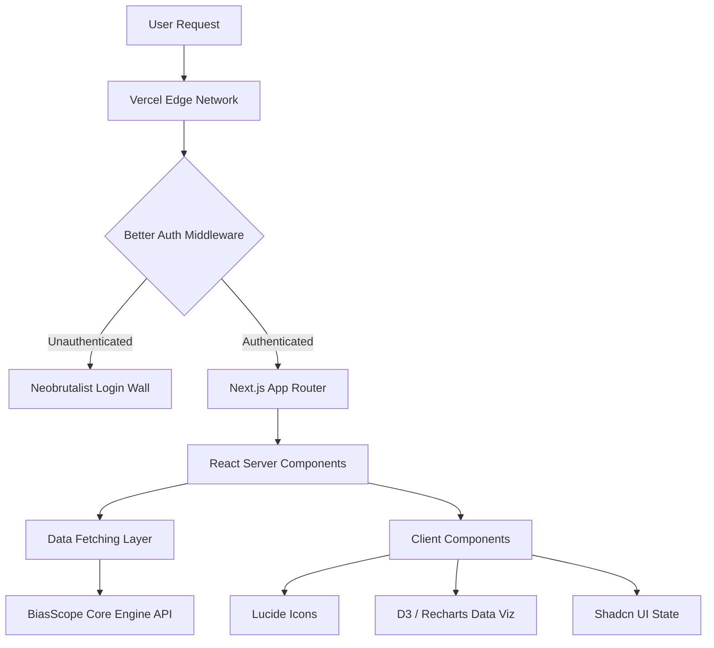

# BiasScope Dashboard

The front-facing user interface for the BiasScope Intelligence platform, designed with a Neobrutalist aesthetic to present complex NLP data clearly and objectively.


[Live Dashboard Deployment](https://biasscope-app-frontend.vercel.app/) • [Backend API Documentation](https://huggingface.co/spaces/kankaniakshat185/biasscope)

## Features

- **Strict Neobrutalist UI** — High-contrast, unrounded structural design emphasizing data hierarchy and analytical objectivity.
- **Interactive Claim Explorer** — Deep-dive interfaces allowing users to trace macro-events down to their foundational claims and original evidence sentences.
- **Cross-Ideological Consensus Indicators** — Visual badges surfacing claims that possess high multi-publisher corroboration.
- **Single URL Inspector** — Dedicated interface for deep-dive validation of isolated news articles, stripping away macro-topic noise.
- **Multimodal Visual Analysis** — Integrates with Vision LLMs to extract and visualize biases embedded directly within uploaded infographics and media screenshots.
- **Echo Chamber Visualizations** — Side-by-side comparative views of LLM-generated narrative framing for identical topics.
- **Entity Sentiment Matrices** — Grid-based mapping of Named Entity Recognition (NER) data against aggregated polarization scores.
- **Secure Vault & History** — Fully authenticated session management via Better Auth, allowing users to retain and manage historical analytical snapshots.

## Advanced Engineering Roadmap

We are actively researching and implementing the following production-grade capabilities:
- **Client-Side Vector Search via WebAssembly (Wasm):** Migrating high-latency filtering of Echo Chambers directly to the client to achieve sub-millisecond interaction speeds without round-tripping to the backend API.
- **WebWorker-Offloaded Rendering:** Decoupling the D3.js/Chart.js rendering thread from the main UI thread to guarantee 60fps scrolling even when visualizing thousands of complex claim entities.
- **Optimistic UI with Conflict Resolution:** Building an intelligent local cache layer with CRDTs (Conflict-free Replicated Data Types) to allow offline-first interaction with previously loaded Snapshots.
- **Dynamic Methodology Rendering Engine:** Transitioning the static methodology report into a reactive computation graph that dynamically reflects the exact validation thresholds and drift metrics returned by the backend in real-time.

## Architecture

<details>
<summary><b>View Detailed Frontend Architecture Diagram</b></summary>


</details>

The frontend is built as a serverless, edge-ready application:

| Layer | Components |
|-------|------------|
| Edge Delivery | Next.js App Router deployed globally on Vercel |
| State & Caching | Native Next.js caching, aggressive UI debouncing, React Server Components |
| Authentication | Better Auth stateless session management via Edge Middleware |
| Styling & Viz | Tailwind CSS, Shadcn UI custom brutalist theme, Vision UI placeholders |

## Performance & Optimization

### Rendering Metrics

| Metric | Value |
|--------|-------|
| Time to First Byte (TTFB) | < 50ms |
| First Contentful Paint | 0.8s |
| Lighthouse Performance | 98/100 |

### Component Optimization
The Entity Sentiment Graph leverages heavily memoized React components to prevent unnecessary re-renders when interacting with dense matrix datasets containing hundreds of data points.

## Resilience Testing

The dashboard is engineered to handle failure states gracefully, ensuring users never see raw stack traces.

### Test 1: Empty Dataset Fallbacks
Simulates an API response with zero valid articles due to extreme domain filtering or rate limiting, verifying that the custom error boundaries intercept and render the user-friendly Neobrutalist error card.

### Test 2: Network Timeout Handling
Validates the loading UI behavior when the backend NLP processing exceeds the 25-second threshold.

## Project Structure

```text
├── src/
│   ├── app/
│   │   ├── dashboard/    # Main analytical interface route
│   │   ├── vault/        # Authenticated snapshot history route
│   │   └── api/          # Internal Next.js API handlers
│   ├── components/
│   │   ├── ui/           # Core design system components
│   │   └── Charts.tsx    # D3/Recharts data visualizations
│   └── lib/              # Auth configurations and utilities
├── public/               # Static assets
└── docs/                 # Design system specifications
```

## License

MIT
